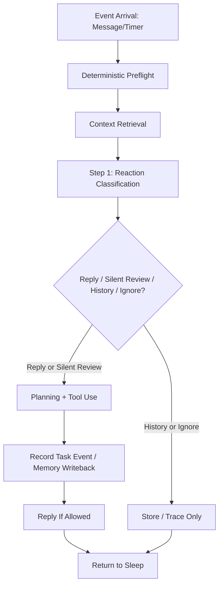

# AI Agentic Core Blueprint: The Reasoning Brain

This document serves as the high-level architectural specification for the "Brain" of the WhatsApp AI Employee. It defines how the agent thinks, remembers, and acts autonomously to achieve company objectives.

---

## 1. Executive Summary
The system is transitioning from a **Reactive Chatbot** (RAG-based) to a **Proactive Agentic System**. 
- **Difference:** While a chatbot waits for a prompt and answers based on history, this Agent owns **Objectives** (Tasks). It manages context, uses tools, and initiates communication across different stakeholders to move a task from "Requested" to "Completed".

---

## 2. Core Architecture: The "Thinking" Loop
The Agent operates on a **ReAct (Reasoning + Acting)** loop. Every event (WhatsApp message, cron timer, or system alert) triggers a "Wake Up" cycle.

### 2.1 Deterministic Preflight
Before deeper reasoning, the system should only do objective work:
1.  duplicate detection
2.  protocol/noise skip
3.  media/document extraction
4.  PM vs group detection
5.  sender and group metadata capture

This layer should not try to solve social meaning with a growing list of phrase rules.

### 2.2 Context Retrieval (The Preparation)
Before thinking, the system gathers:
1.  **Human API Profile:** Who is talking? (Internal/External, Department, Domain Authority).
2.  **Task Memory:** Are there active tasks linked to this person?
3.  **Knowledge Base:** Relevant company facts and policies.
4.  **Discussion Cache:** Recent relevant conversation threads.
5.  **Audience Context:** PM or group, and when available, who else can see the message.

### 2.3 Step 1: Reaction Classification
The first LLM step should answer:
- is this message addressed to the agent?
- if not, should it still be silently reviewed?
- is this casual chat, important info, task request, clarification, or something else?
- should the system reply now, stay silent, or ignore it?
- does the system need human clarification before acting?

The output should be a strict structured contract such as:
- `reply_now`
- `silent_review`
- `history_only`
- `ignore`

### 2.4 Step 2: Planning And Action
Only after the reaction is known should the planner produce structured work:
- reply proposal
- task updates
- reminders
- memory updates
- clarification question
- tool calls

---

## 3. Context Management (The Memory Layer)
Memory is split into **Audit Logs** (Raw Chat) and **Structured Brain** (Postgres).

### 3.1 Human API (Advanced Contact Book)
People are modeled as prioritized sources of truth.
- **Fields:** WhatsApp No, Name, Source (Intro by who), Internal (Boolean), Position/Role, Department, Relation Type (Supplier/Customer), and **About Person** (Custom operational context).

Important behavioral rule:
- Human API is not only a messaging target
- it is also the preferred truth source for internal ambiguity

If the agent does not understand:
- an internal acronym
- an unknown person in a group
- an organization-specific instruction
- a private process or shorthand

it should prefer asking the right known human over hallucinating or defaulting to web search.

### 3.2 Task-Centric Persistence
Tasks are first-class citizens. If a task spans 3 days and 4 stakeholders, the Agent keeps the **Task ID** as the anchor, not the individual chat threads.
- **Task State:** `TODO` -> `IN_PROGRESS` -> `BLOCKED (WAITING)` -> `COMPLETED`.
- **Task Timeline:** Every action taken by the AI or reply from a human is logged to the specific Task Event history.

---

## 4. Capability Layer (Tools Arsenal)
The Agent has "Hands" to interact with the world:
1.  **Communication Tool:** Send/Receive WhatsApp messages (Baileys).
2.  **Resource Tool:** Web Search (Perplexity/Sonar) for real-time data.
3.  **Execution Tool:** Registry of internal functions (e.g., Update Task status).
4.  **Scheduler Tool:** Internal Cron (Self-wakeup / Follow-ups).
5.  **Data Tool (Future):** Read-only access to Company Production Postgres/ERP.

---

## 5. Behavioral Philosophy & Safety

### 5.1 The "Think -> Tool -> Human" Priority
1.  **Think:** Try to solve with existing memory.
2.  **Human API:** If the unknown is internal, social, or organization-specific, ask the right trusted human.
3.  **Tool:** Use search or DB when the question is genuinely external/public or system-readable.

This is a deliberate correction to generic chatbot behavior.

The agent should not:
- invent internal meanings
- pretend to know who an unknown group member is
- use web search as the default answer source for private context

### 5.2 Conflict Resolution
When two "Human APIs" provide conflicting info:
- **Do not overwrite.** 
- **Open a Clarification Thread.** 
- The Agent acts as a mediator, bringing the discrepancy to the relevant authorities to reach a "Working Truth".

### 5.3 Safety Gating (The 90-Day Internship)
- **Low Risk:** Reminders, follow-ups, and data gathering run autonomously.
- **Sensitive:** HR issues, disciplinary actions, or major company statements are gated and require "Initiator" approval before sending.

### 5.4 Permissioning & Outreach Rules
To prevent accidental "Spam" or unauthorized disclosure:
- **Whitelisting:** In v1, the Agent can only message numbers already present in the `Human API` table.
- **Authority Check:** Before the Agent asks a "CEO" level question, it must verify the requester's `Authority Level` in Postgres.
- **CC Mode:** All autonomous outreach to external parties (Suppliers/Customers) can be configured to automatically "CC" (Forward) the summary to the Initiator for transparency.

### 5.5 Participation Rules For Group Chat
Group chat should not be treated as lower-value reasoning input.

Instead, it should be treated as different social context.

That means:
- PM usually implies the agent is being addressed
- group chat does not automatically imply the agent should reply
- once a group message is selected for reasoning, its weight should depend on:
  - who said it
  - what they said
  - who could see it

This is why audience context matters:
1.  who wrote this
2.  what was said
3.  who saw this

That full message context is what the agent should "see" before deciding how to react.

---

## 6. Reliability & Resilience

### 6.1 Tool Failure Handling
If an external API (like Perplexity or the Company ERP) is down:
- The `AgentRunner` captures the error as a "Task Event".
- The Reasoning Loop is re-triggered with the error context.
- **Logic:** "Tool X failed. I should try an alternative tool or inform the human I am temporarily blocked."

### 6.2 The "Infinite Loop" Breaker
To prevent the AI from "thinking" in circles:
- **Step Limit:** Each task execution has a maximum of 5 tool calls per "Wake Up".
- **Human Hand-off:** If 5 steps are reached without progress, the Agent must message a Human API for guidance.

---

## 7. Security & Data Privacy

### 7.1 Data Storage
- **WhatsApp:** Messages remain end-to-end encrypted on the device, but the *Agent Database* logs are unencrypted for "Reasoning" purposes.
- **ERP Protection:** Access to production data is **Read-Only**. The Agent has zero "Write" credentials to company production systems.

### 7.2 System Auditability
Every "Thought" and "Action" is logged with a timestamp and a "Provenance Link" back to the original human message that triggered it. This creates a 100% transparent paper trail for management.

---

## 8. Technical Stack Summary
- **Runtime:** Node.js / TypeScript.
- **Communication:** Baileys (WhatsApp).
- **Storage:** PostgreSQL (Agent State + Memory).
- **Reasoning:** LLM Router (UniAPI-Gemini / OpenAI) with strict JSON enforcement.
- **Scheduling:** Postgres-backed internal job queue.

---

## Open Questions for Reviewers

> [!IMPORTANT]
> 1. **Autonomous Friction:** Should the Agent always "CC" the Initiator on conversations with external suppliers, or should it handle them silently unless there is a cost/decision involved?
> 2. **Task Creation:** Should the AI automatically create a `Task` for *every* instruction, or only when it detects a multi-step objective?
